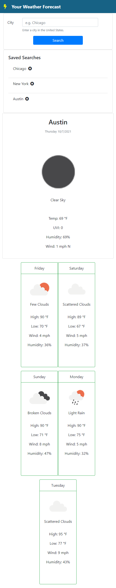

# Your Weather Forecast

## Summary

A simple and intuitive weather forecast application suitable for anyone. Your search results are automatically saved for every new search you make. So, whenever you come back, your past search results will be there waiting for you! 

## Link to Project
[Your Weather Forecast - GitHub Pages](https://damienluzzo33.github.io/Your-Weather-Forecast/)

## Features

+ User can search for the weather forecast in any city in the united states
+ When user searches for their local weather report, they will be presented with the current weather as well as the projected weather for the next five days
+ Every time a user searches a city, that search result is saved in local storage
+ User will be able to get information about the current temperature, wind, humidity, weather status, a helpful image/icon, projected high/low temps for days to come, as well as the current UVI.

## Future Features

+ Provide the user with the ability to delete past search results
+ Prevent duplicate searches
+ Convert wind direction from degrees to N,E,S,W values

## Screenshots

### Desktop

### Mobile

## Other

+ Worked on this individually but also worked alongside numerous bootcamp classmates to help familiarize them with API calls and Bootstrap.
+ Took design inspiration from the examples that were shown in class